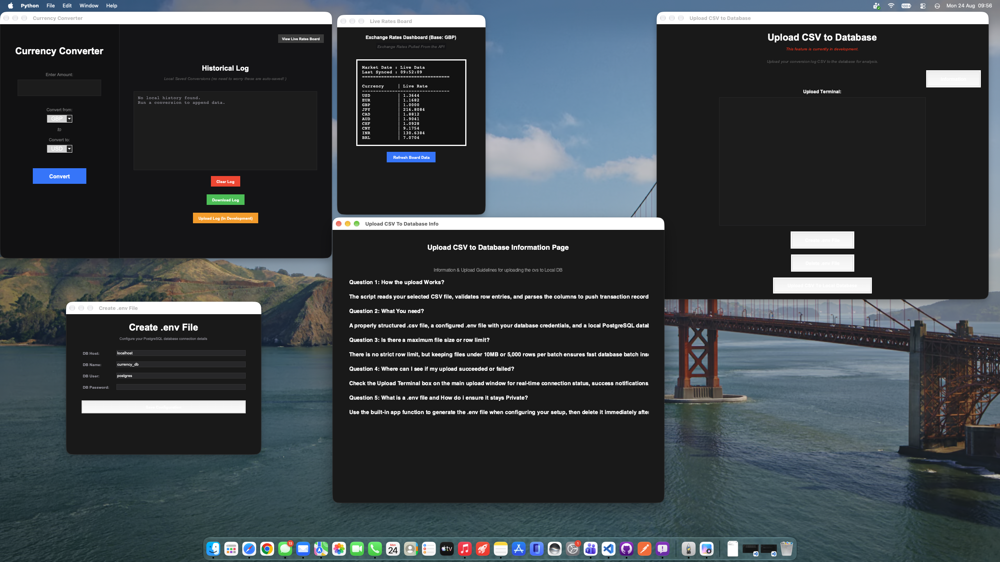

## All in One Currency Converter

> [!WARNING]
> Active Development: This application is fully functional, but the user interface is still undergoing active design changes. Some features may be missing or unpolished as development continues.

# Project Description 


* Built an all-in-one desktop currency converter in Python (Tkinter) tailored for retail environments requiring fast, frequent daily currency calculations.

* Features a non-technical, user-friendly single-page UI that pairs an Ingestion & Processing calculator with an Analytics & Storage dashboard, letting staff review transaction histories and plan upcoming exchanges simultaneously.

* Integrates flat-file CSV logging with an automated ingestion pipeline to load converted currency data directly into a local PostgreSQL database.

# User Interface

The application features a dark-themed, multi-window layout built in Tkinter that breaks core functionality into focused modal windows for retail ease of use:

* **Main Converter & Historical Log:** Features a quick-entry currency conversion calculator on the left, paired with a real-time flat-file historical logging panel on the right with options to clear, download, or trigger database ingestion.
* **Exchange Rates Dashboard:** Displays live base exchange rates (GBP) across major global currencies in a clean reference table.
* **Database Ingestion Terminal:** Provides a visual terminal output window for tracking real-time status and logs when pushing CSV files into PostgreSQL.
* **Database Information Page:** Built-in onboard documentation answering common user questions, database row limits, and troubleshooting steps for non-technical staff.
* **Database Environment Setup (`.env` Config):** A quick configuration modal for managing local database connection parameters (DB Host, DB Name, DB User, and Password) dynamically.


*Figure 1: Full desktop setup featuring live currency calculations alongside background logging and database management windows.*

# Feature Set 

* **Real-Time Currency Conversion:** Instantly calculates exchange rates using custom cross-rate logic with a simplified, non-technical calculator interface designed for fast retail transactions.
* **Dual-Pane Main Window:** Displays a live converter alongside an active **Historical Log** panel, allowing users to track prior conversions and plan upcoming transactions simultaneously on a single screen.
* **Local Flat-File Logging:** Automatically writes every converted transaction to a structured local CSV file with options to view, clear, or export logs locally.
* **PostgreSQL ETL Pipeline:** Features a dedicated upload window and terminal output box that reads CSV transaction logs and ingests records directly into a local PostgreSQL database for permanent storage.
* **Live Exchange Rates Board:** Opens a dedicated reference board displaying real-time exchange rates against base currency (GBP) across major global currencies.
* **Dynamic `.env` Configuration:** Includes a built-in GUI configuration modal to seamlessly set up local database connection parameters (DB Host, DB Name, DB User, and Password) without editing source code.
* **Onboard Help & Documentation:** Integrates an in-app information page answering common upload questions, batch processing limits, and troubleshooting steps for non-technical users.

## Supported Currencies

The application supports cross-rate conversion calculations for 10 major global currencies:

| Code | Currency Name |
| :--- | :--- |
| **GBP** | British Pound Sterling (Default Base) |
| **USD** | United States Dollar |
| **EUR** | Euro |
| **JPY** | Japanese Yen |
| **CAD** | Canadian Dollar |
| **AUD** | Australian Dollar |
| **CHF** | Swiss Franc |
| **CNY** | Chinese Yuan |
| **INR** | Indian Rupee |
| **BRL** | Brazilian Real |

## Tech Stack

* **Language:** Python 3.x
* **GUI Framework:** Tkinter
* **Database:** PostgreSQL
* **Database Driver:** `psycopg2`
* **Data Handling:** CSV / Pandas / `python-dotenv`

## Prerequisites & Setup

### Prerequisites

Ensure you have the following installed on your system before running the application:

* **Python 3.10+**
* **PostgreSQL** (running locally)

Clone The REPO:
```bash
git clone https://github.com/Wright18Ted/Currency-Converter-Desktop-App-.git
```

Install the required Python packages:

```bash
pip install psycopg2-binary requests python-dotenv
```

Run main.py to run the application 

Configure database credentials:
* Click the Create .env File button inside the app UI.
* Enter your local PostgreSQL host, database name, user, and password parameters.
* Save the configuration to establish database ingestion functionality.
* Run the Upload Log (In Developement) to see the Conversion Database load in the local DB